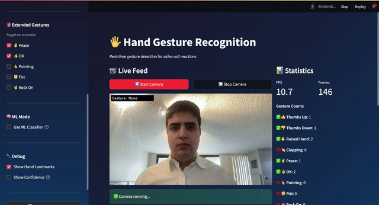

# Hand Gesture Recognition for Video Call Reactions

Real-time hand gesture recognition using MediaPipe and OpenCV. Detects common video call gestures and displays emoji reactions on screen.



## Supported Gestures

| Gesture | Emoji | How to Perform |
|---------|-------|----------------|
| Thumbs Up | 👍 | Thumb pointing up, other fingers curled |
| Thumbs Down | 👎 | Thumb pointing down, other fingers curled |
| Raised Hand | ✋ | Open palm with all fingers extended |
| Clapping | 👏 | Two hands close together |
| Peace | ✌️ | Index and middle fingers extended in a V |
| OK Sign | 👌 | Thumb and index finger forming a circle |
| Pointing | 👆 | Index finger extended, others curled |
| Rock On | 🤘 | Index and pinky fingers extended |
| Fist | ✊ | All fingers curled into a fist |

## How It Works

This project uses a two-stage pipeline for gesture recognition:

### Stage 1: Hand Detection & Landmark Extraction

[MediaPipe Hands](https://github.com/google-ai-edge/mediapipe/blob/master/docs/solutions/hands.md) detects hands in the webcam feed and extracts 21 3D landmarks per hand (wrist, finger joints, fingertips). OpenCV handles webcam capture and image processing (frame capture, color conversion, display).

### Stage 2: Gesture Classification

The system supports two classification approaches:

#### Rules-Based (Heuristic)

Uses geometric relationships between landmarks to identify gestures. For example, **Thumbs Up** is detected by checking:
1. **Thumb pointing up** — thumb tip is significantly above the thumb base (y-coordinate difference > 0.08)
2. **Other fingers curled** — each fingertip is at or below its corresponding knuckle (MCP joint)

This approach is fast, interpretable, and requires no training data.

#### ML-Based (Random Forest)

A trained classifier that takes normalized landmark coordinates as input:
1. All 21 landmarks are normalized relative to the wrist position
2. Coordinates are scaled so the maximum distance from wrist equals 1
3. The 63 features (x, y, z for each landmark) are fed to a Random Forest model
4. The model outputs a gesture prediction with a confidence score

The ML model achieves **98.9% accuracy** across 9 gesture classes. Training data was collected using the built-in data collection tool, recording landmark positions for each gesture across varying hand positions, distances, and lighting conditions.

## Prerequisites

- Webcam
- Conda (Miniconda or Anaconda)

## Setup

1. **Create and activate the conda environment:**

   ```bash
   conda create -n hands python=3.11
   conda activate hands
   ```

2. **Install dependencies:**

   ```bash
   pip install -r requirements.txt
   ```

## Running

Make sure your conda environment is activated:

```bash
conda activate hands
```

### Option 1: Streamlit Web UI (Recommended)

Launch the interactive web interface:

```bash
streamlit run app.py
```

This opens a browser with:
- Live webcam feed
- Gesture toggle controls
- Statistics dashboard
- Reaction history log

### Option 2: Data Collection Tool

Collect labeled training data for ML:

```bash
streamlit run data_collection.py
```

Features:
- Create/load data collection sessions
- Record landmark data with gesture labels
- Progress tracking per gesture class
- Export combined CSV for training

#### Data Collection Guidelines

| Aspect | Recommendation |
|--------|----------------|
| **Duration** | 3-5 seconds per clip, 150+ samples per gesture |
| **Hands** | One hand at a time; record both hands separately |
| **Distance** | Vary between close-up and arm's length |
| **Lighting** | Good front lighting, avoid backlight |
| **Quality** | Hold steady, wait for "Hand Detected" before recording |

### Option 3: Model Training

Train ML classifiers on collected data:

```bash
streamlit run train_model.py
```

Features:
- Random Forest (fast, recommended)
- SVM with One-vs-One strategy (accurate)
- Cross-validation and metrics
- Model export for deployment

### Option 4: OpenCV Desktop App

Run the standalone desktop version:

```bash
python gesture_recognition.py
```

#### OpenCV Controls

| Key | Action |
|-----|--------|
| `q` | Quit the application |
| `d` | Toggle debug mode (shows hand landmarks) |

## Troubleshooting

### Webcam not detected
- Ensure your webcam is connected and not in use by another application
- On macOS, grant Terminal/IDE camera permissions in System Preferences → Privacy & Security → Camera

### Emoji not displaying correctly
- The app uses system fonts for emoji rendering (Apple Color Emoji on macOS, Segoe UI Emoji on Windows, Noto Color Emoji on Linux)
- If emoji appear as boxes, install an emoji font for your system

### Poor gesture detection
- Ensure good lighting
- Keep your hand clearly visible in frame
- Press `d` to enable debug mode and verify hand landmarks are being tracked

